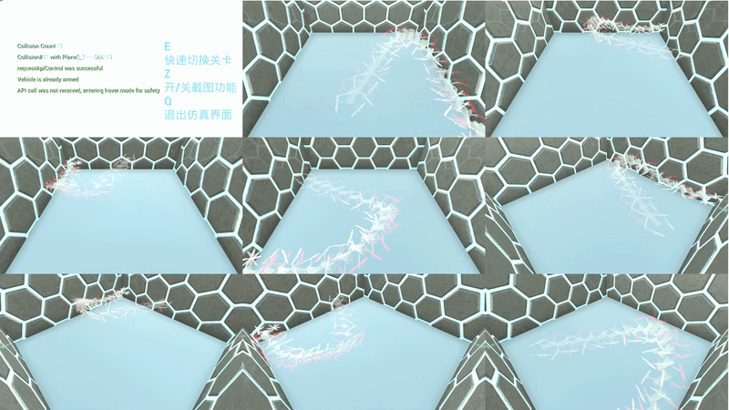
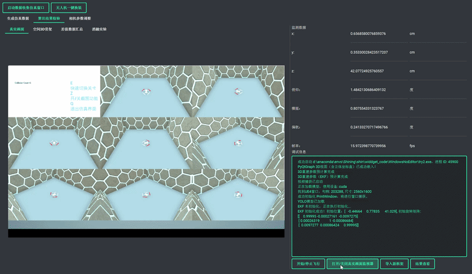

---

# 基于多点视觉信息的无人机位姿估计

[](https://opensource.org/licenses/MIT)
[](https://www.python.org/downloads/release/python-380/)
[](https://www.unrealengine.com/)
[](https://github.com/ultralytics/ultralytics)

## 📖 项目简介

本项目实现了一套**基于纯视觉多点信息的室内无人机位姿估计全链路系统**。针对室内无 GPS 环境下无人机定位依赖昂贵动捕系统或特殊传感器（如红外、RGB-D）的痛点，本项目采用 **纯 RGB 多相机 + 仿真驱动** 的方案，构建了低成本、易部署的位姿感知与验证平台。

整体系统覆盖了**仿真环境搭建 → 自动化数据生成 → 前端深度学习检测 → 后端多算法位姿解算 → 三维可视化**的全流程，旨在为室内无人机视觉导航研究提供一个可复用、可扩展的基准平台。

## ✨ 核心特性

- 🎮 **仿真驱动的自动化平台**：基于 UE4 与 AirSim 搭建高保真仿真环境，设计了空白房间、障碍物房间、室外操场三类场景。开发了图形化控制端，实现无人机飞行控制、多相机图像采集、真值投影与 YOLO 格式数据集生成的**全自动化闭环**。
- 🎯 **关键点检测与多算法融合**：利用 YOLOv8-pose 实现无人机关键点检测，并设计对比了三种递进式的位姿估计算法：
  - **最小二乘几何法 (LS + Kabsch)**：无状态瞬时解算，作为精度基线；
  - **紧耦合扩展卡尔曼滤波**：直接将 2D 像素观测作为滤波输入，充分利用冗余信息；
  - **松耦合扩展卡尔曼滤波 (LS + EKF)**：以 LS 重建的 3D 关键点为观测，引入空间域平滑隔离视觉噪声，在低频更新下鲁棒性更优。
- 🛡️ **系统性的鲁棒性验证**：设计了涵盖基础精度、动态跟踪滞后、视觉干扰（遮挡、噪点、天气模拟）及相机数量/布局退化消融实验的全面评价体系，客观评估了不同算法的适用边界。
- 🌐 **完整开源与高复用性**：从仿真环境配置、自动化数据生成工具到多算法估计算法均完整开源，为室内无人机视觉导航研究提供可复现的基准平台。

## 🖼️ 效果展示
- 飞行仿真界面


- 位姿解算界面



## 📂 项目结构

```
.
├── control_code/                 # 核心控制与算法代码
│   ├── YOLO_try/                 # YOLOv8 训练相关脚本与权重
│   ├── collect.py                #飞行控制辅助代码（没啥用，不用看）
│   ├── split.py                  #数据集制造辅助代码（没啥用，不用看）
├── test/                         # 单元测试与调试脚本
├── widdget_code/                 # 自定义 PyQt 控件与可视化组件
│   ├── Shining.py                # 主程序入口（仿真控制端）
│   ├── 3D_2D.py                  # 数据集制造辅助代码（运行完这个运行makedataset.py，在YOLO_try里头）
│   ├── main_log.py               # 主函数（仿真控制端）
│   ├── start_window.py           # 启动界面（非主要）
│   ├── global_import.py          # 全局变量与参数定义（含相机内参、EKF调参等）
│   ├── recorder/                 # 自动生成的飞行记录数据（JSON）
│   ├── WindowsNoEditor/try2/connect/ # UE4 通信目录（触发文件）
└── requirements.txt              # Python 依赖列表
```

## 🛠️ 环境配置

### 1. 基础环境
- **操作系统**：Windows 10/11
- **Python**：3.8.20
- **GPU**：NVIDIA GeForce RTX 系列（推荐，用于 YOLO 推理加速）
- **UE4 项目**：需自行配置 AirSim 插件并放置于 `WindowsNoEditor` 目录下

### 2. 安装依赖
```bash
pip install -r requirements.txt
```

主要依赖包：
- `PySide6`：图形界面框架
- `qt-material`：界面美化主题
- `airsim`：AirSim Python API
- `ultralytics`：YOLOv8 推理
- `numpy`, `scipy`, `matplotlib`：科学计算与绘图
- `pyqtgraph`：3D 实时渲染
- `opencv-python`：图像处理
- `numdifftools`：数值雅可比计算

### 3. YOLO 模型权重
将训练好的 YOLOv8-pose 权重文件 `best.pt` 放置于 `control_code/` 目录下，或在 `global_import.py` 中修改 `pt_name` 变量指向正确路径。（本项目支持热插拔，亦可在软件界面中直接提交训练好的 pt 文件）。
### 4. UE4 仿真项目
请确保 UE4 项目已正确配置 AirSim，并将项目文件夹命名为 `WindowsNoEditor` 置于项目根目录（或修改 `global_import.py` 中的相关路径）。
## ⚙️ 核心参数配置
在 `global_import.py` 中可调整系统底层参数，主要配置如下：
| 变量名 | 含义 | 默认值 |
| :--- | :--- | :--- |
| `K` | 相机内参矩阵（3x3） | 仿真标定值 |
| `rotor_position` | 无人机四个旋翼的机体坐标 | DJI Mini 4 Pro 骨架 |
| `l` | 相机分布球面半径 | 1600 |
| `angle` | 相机俯仰角 (度) | 45 |
| `picture_split` | 8路拼接图切割坐标 | 预设值 |
| `R_diag_global` | 松耦合 EKF 观测噪声方差 | 10 |
| `r_pixel` | 紧耦合 EKF 像素观测标准差 | 0.5 |
| `q_a_global` | 线加速度过程噪声谱密度 | 500 |
| `q_alpha_global` | 角加速度过程噪声谱密度 | 0.2 |
| `manual_delay` | 松耦合延迟补偿 (秒) | 0.1 |
## 🚀 运行指南
### 1. 运行主控制端
```bash
cd widdget_code
python Shining.py
```
### 2. 操作流程
1. **连接 AirSim**：点击界面“开启仿真数据收集端口”按钮，建立与 UE4 的通信。
2. **算法运行模式**：系统默认并行运行三种算法（LS、松耦合、紧耦合）以进行实时对比验证。如遇算力瓶颈，可在代码中限制图传帧率。
3. **轨迹设置**：选择预设轨迹（圆形、方形、8字）或启用“随机飞行”进行高机动测试。
4. **干扰与消融配置**：勾选“落叶干扰”（模拟视觉噪声）、“相机屏蔽”（模拟传感器失效）等选项进行鲁棒性测试。
5. **开始实验**：点击“开始”按钮，无人机按设定飞行，右侧面板实时显示位姿估计结果与重投影误差。
6. **数据记录**：所有飞行真值与估计值将自动保存至 `recorder/` 目录下的 JSON 文件中。
### 3. 可视化窗口
- **3D 骨架图**：实时绘制无人机 5 个关键点（中心 + 4 旋翼）的空间位置。
- **误差监测面板**：动态显示 `(x, y, z, roll, pitch, yaw)` 的数值及与真值的差值。
- **轨迹对比图**：飞行结束后自动绘制真值轨迹与估计轨迹的 3D 对比图。
## 🧠 核心算法说明
本项目实现了三种递进式的位姿估计算法，重点对比了在低频图传（3.75Hz）下不同融合架构的精度与鲁棒性边界。
### 1. 纯几何解算 (LS + Kabsch)
利用多视角几何的射线交叉约束进行最小二乘三维重建，并结合 Kabsch 算法求解位姿。作为无状态的瞬时解算，它是系统精度的基线，但在动态工况下存在严重的高频抖动。
### 2. 松耦合扩展卡尔曼滤波 (Loosely-Coupled EKF)
将 LS 重建的三维关键点坐标作为观测输入进行时间域滤波。**核心优势**：LS 模块充当了“物理抗混叠隔离层”，在多视角交汇时有效稀释了运动模糊与视觉噪声的干扰，使得后端 EKF 能在干净的三维空间中平滑工作。在大部分常规及干扰工况下，该架构展现出最优的鲁棒性。
### 3. 紧耦合扩展卡尔曼滤波 (Tightly-Coupled EKF)
**状态向量** (13维)：`[px, py, pz, vx, vy, vz, qw, qx, qy, qz, wx, wy, wz]`
将多相机的**二维像素坐标**直接作为观测输入，绕过显式三维重建，在像素残差层面对状态量进行修正。**核心优势**：彻底规避了中间模块的数据流转开销，单步耗时仅 10.3ms。在极端弱几何约束（如仅剩2台相机）下，紧耦合能榨取微弱统计信息实现兜底，且其低带宽输入特性为未来“感知-控制”物理分离的异构部署提供了极佳的接口。
## 📊 实验数据与鲁棒性分析
采用**多视角重投影像素误差**作为核心评价指标（有效剥离物理尺度标定误差）。以下为典型工况下的平均欧式距离对比：
| 工况 | LS (px) | 松耦合 EKF (px) | 紧耦合 EKF (px) | 结论分析 |
| :--- | :---: | :---: | :---: | :--- |
| **理想圆形轨迹** | 1.18 | **0.98** | 1.00 | EKF 显著抑制高频抖动，两者精度相当。 |
| **随机高机动** | 2.82 | **2.48** | 3.06 | 低频更新致运动模糊，紧耦合“过信任”脏像素致拉扯，松耦合 LS 隔离层发挥去噪优势。 |
| **视觉干扰 (落叶)** | 2.84 | **2.50** | 2.63 | 视觉噪声下，松耦合的空间平滑机制保障了最低误差与最优轨迹平滑度。 |
| **极端退化 (2台相机)**| 3.11 | 2.50 | **2.25** | 几何约束崩塌致 LS 失效，紧耦合凭直接像素映射机制实现兜底。 |


## 🙏 致谢与引用

如果您发现本项目对您的研究有帮助，请引用以下工作：
```
@misc{wang2026uavpose,
  author = {丸子🍡},
  title = {基于多相机纯视觉与紧耦合EKF的室内无人机位姿估计系统},
  year = {2026},
  publisher = {GitHub},
  journal = {GitHub repository},
  howpublished = {\url{https://github.com/Wanzi23234/UAV-MultiCamera-PoseEstimation}}
}
```

本项目受到以下开源项目的启发：
- [Microsoft AirSim](https://github.com/microsoft/AirSim)
- [Ultralytics YOLOv8](https://github.com/ultralytics/ultralytics)
- [PySide6](https://wiki.qt.io/Qt_for_Python)

---

**作者**：丸子 
**联系方式**：2952749640@qq.com  
**项目状态**：积极维护中，欢迎 Star ⭐ 和 Issue 反馈。
